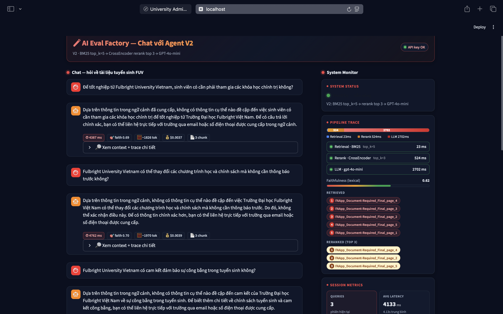
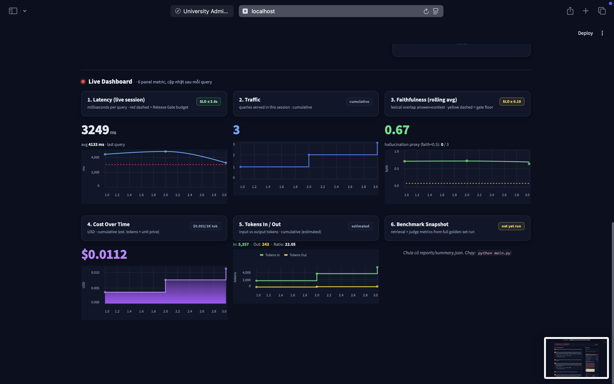
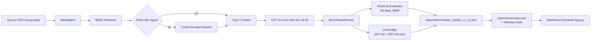

# Lab15 - AI Evaluation Factory

## Mô Tả Ngắn Dự Án
Bài toán theo **Worksheet 0 - Scenario Card** với bối cảnh hệ thống `University Admission & Student Support Agent`.

Hệ thống phục vụ 3 nhóm người dùng chính:
- `Thí sinh`: tìm hiểu thông tin và đăng ký tuyển sinh.
- `Sinh viên năm nhất`: hỗ trợ nhập học và onboarding.
- `Cán bộ tuyển sinh`: theo dõi, phân tích và tối ưu kết quả tuyển sinh.

Về kiến trúc logic, có 4 giao diện độc lập (`Thí sinh UI`, `SV năm nhất UI`, `Cán bộ UI`, `IT Helpdesk UI`) dùng chung một AI Core (`LLM + RAG + Data`). Dữ liệu chính gồm FAQ tuyển sinh, quy định đào tạo, biểu mẫu và dữ liệu hồ sơ ứng viên. Hệ thống tích hợp các năng lực như Knowledge Base, RAG, Timeline/Recommendation Engine, Predictive Model, State Tracking, Notification, Data Analytics và Text-to-SQL.

Thừa kế từ hệ thống benchmark Agent RAG theo hướng "Evaluation Factory", dùng để so sánh chất lượng giữa hai phiên bản `v1` và `v2` bằng các nhóm chỉ số:
- Retrieval: `hit_rate`, `MRR`
- Chất lượng trả lời: Multi-Judge (`gpt-4o` + `gpt-4o-mini`)
- Độ tin cậy: `faithfulness`, `relevancy`
- Hiệu năng: `latency`, ước tính chi phí token

## Demo
- Ứng dụng Streamlit: [https://lab15-demo.streamlit.app/](https://lab15-demo.streamlit.app/)
- Password: >! lab15-20KAI !<

## Preview Slide Của Team
- Slide HTML: [slide/E402_Nhom1_Presentation_1.html](slide/E402_Nhom1_Presentation_1.html)

Gợi ý xem nhanh:
- Mở trực tiếp file HTML ở trên bằng trình duyệt để xem đầy đủ hiệu ứng.
- Hai ảnh dưới đây là preview màn hình demo của hệ thống.

### Ảnh Demo



## Kiến Trúc Hệ Thống


## Luồng Xử Lý Chính
1. Nạp dữ liệu PDF nguồn từ thư mục `data/`.
2. `MainAgent` tạo chunk theo trang, chạy BM25 retrieval.
3. Nếu là `v2`, hệ thống rerank lại context bằng Cross-Encoder.
4. LLM (`gpt-4o-mini`) sinh câu trả lời dựa trên context cuối cùng.
5. `BenchmarkRunner` chạy toàn bộ dataset theo batch bất đồng bộ.
6. `RetrievalEvaluator` tính `hit_rate`, `MRR`; `LLMJudge` chấm điểm chất lượng.
7. `main.py` tổng hợp metric, so sánh `v1`/`v2`, áp `release gate`, xuất report.
8. `app.py` hiển thị chat demo + monitor + số liệu benchmark.

## Thành Phần Quan Trọng
- `agent/main_agent.py`: pipeline Agent thực tế (BM25, rerank tùy phiên bản, LLM generation).
- `main.py`: điều phối benchmark `v1` và `v2`, tổng hợp metrics, quyết định release gate.
- `engine/runner.py`: chạy benchmark async theo batch để giảm thời gian.
- `engine/retrieval_eval.py`: tính toán chỉ số retrieval (`hit_rate`, `MRR`).
- `engine/llm_judge.py`: cơ chế chấm điểm đa mô hình, đo agreement, fallback khi cần.
- `app.py`: giao diện Streamlit để demo và theo dõi trạng thái hệ thống.

## Cài Đặt Và Chạy Nhanh
```bash
pip install -r requirements.txt
python data/synthetic_gen.py
python main.py
streamlit run app.py
```

## Kết Quả Đầu Ra
- `reports/benchmark_results_v1.json`
- `reports/benchmark_results_v2.json`
- `reports/benchmark_results_v1_v2.json`
- `reports/summary.json`
